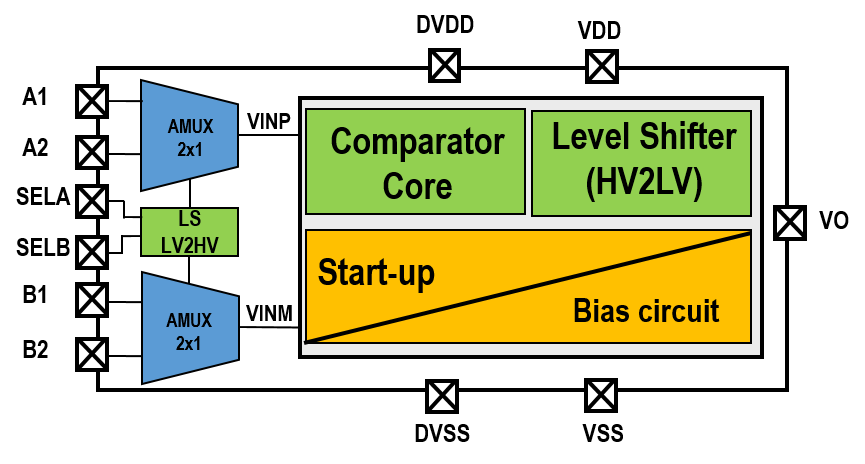
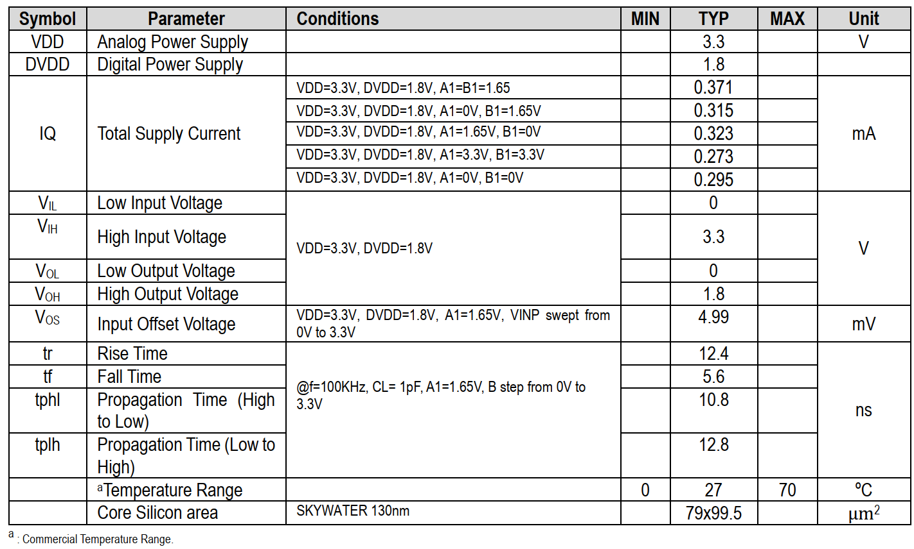

# Overview
This repo contains a Rail-Rail Dual Channel Voltage Comparator, Dual Power Supply titled "EF_R2RVC02"

# Prerequisites

*	OS tested: [Linux Ubuntu 64-bit 22.04.1-desktop-amd64](https://ubuntu.com/download/desktop)
*	[XSCHEM V3.1.0](https://xschem.sourceforge.io/stefan/index.html) is a schematic capture program that provides a graphical method of the electronic schematic circuit, easily.
*	[NGSPICE-36](http://ngspice.sourceforge.net/download.html) is an open-source spice simulator. It is exploited to simulate and verify the designed circuit.
*	[MAGIC 8.3.427](http://opencircuitdesign.com/magic/) is for layout implementation and DRC checks as well.
*	[NETGEN 1.5.245](http://opencircuitdesign.com/netgen/) is used for comparing netlists of the layout and schematic, known as layout vs. schematic (LVS).
*	[PYTHON 3.10.12](https://www.python.org/) can be integrated with the NGSPICE simulator for data manipulation/analysis of the simulation result.

# Quickstart

1. Clone repo or download via IPM

      * To clone repo

      ```
      git clone https://github.com/efabless/EF_R2RVC02.git
      ```

      * To download via [IPM](https://github.com/efabless/IPM/blob/main/README.md)

      ```
      ipm install EF_R2RVC02
      ```

2. Set environment variables

      You need to already have the PDK, you can use [volare](https://github.com/efabless/volare) to download the pdk
      ```
      export PDK_ROOT=<path to pdk>
      ```

3. Run simulation

      To run simulation go to `./verify/spice`, and run these commands
      ```
      make verify-<test_bench>-<SIM>
      ```
      The `test_bench` is the name of the test bench for example `EF_R2RVC02_dc_sweep_vinp`, the `SIM` is either `layout` or `schematic`
      
      For example:
      ```
      make verify-EF_R2RVC02_dc_sweep_vinp-layout
      ```

      You can find all test benches that can be ran using this command
      ```
      make list
      ```

      **NOTE: ngspice DOES NOT handle environment variables used in the test benches. the Makefile handles that for you, if you wish to use your own command make sure you manually update the spice files**


# 1. Description

* The EF_R2RVC02 is a dual channel rail-to-rail voltage comparator with a built-in reference circuit. Its input consists of an n-differential pair connected with a p-differential pair in parallel. While a class B, which is a CMOS inverter, is utilized for the comparator’s output stage. The comparator operates with dual power supplies of 3.3V and 1.8V. It provides a propagation delay of 12 nA and a maximum quiescent current of 371 μA.



*Figure 1. Functional Block Diagram*

## 2. Features
* Rail-Rail Voltage Comparator.
* Dual Channel.
* Dual Power Supply.
* No Hysteresis.
* 12 ns Propagation Delay Input to Output.
* 371 μA Max Quiescent Current.
* Input Voltage range 0V to 3.3 V.
* Output Voltage range 0 V to 1.8 V.
* 5 mV input offset voltage.


## 3. Applications
* SAR-ADC.
* Pulse Generator.
* Threshold Detector.

## 4. Pin Configuration and Functions

* Corresponding to the Block Diagram of the EF_R2RVC02, each pin name with its function is described in Table 1. Moreover, a typical application of the EF_R2RVC02 configuration is presented in Figure 2 and its timing diagram is illustrated in Figure 3.

*Table 1. Pin Configuration and Functions*


*Figure 2. Typical Application*


*Figure 3. Timing Diagram*

## 5. Electrical Characteristics

* The post-layout simulation results of the proposed EF_R2RVC02 are listed in Table 2. Those parameters are reported at Temp.=27°C, CL=1pF, SELA=1.8V, SELB=1.8V. 
*Table 2. Electrical Characteristics*



## 6. Typical Performance Curves

* The proposed EF_R2RVC02 has been designed and simulated using open-source tools with SkyWater technology. Herein, [XSCHEM](https://xschem.sourceforge.io/stefan/index.html) is a schematic capture program that provides a graphical method of the electronic schematic circuit, easily. [NGSPICE](http://ngspice.sourceforge.net/download.html) is an open-source spice simulator. It is exploited to simulate and verify the designed circuit. The layout of the EF_R2RVC02 is implemented using [MAGIC 8.3](http://opencircuitdesign.com/magic/) and for design rule check (DRC) as well. However, [NETGEN](http://opencircuitdesign.com/netgen/) is used for comparing netlists of the layout and schematic, known as layout vs schematic (LVS). [PYTHON](https://www.python.org/) can be integrated with the NGSPICE simulator for data manipulation/analysis of the simulation result.


#### Next, typical performance curves of the EF_R2RVC02 post-layout simulations are presented. 

* DC Sweep of VINP


(a) 


(b)

*Figure 4. DC sweep simulation result, (a) input (A1)  and output (Vo) voltages, (b) Quiescent current.*

* DC Sweep of VINP and VINM


(a) 


(b)

*Figure 5. DC sweep simulation result, (a) inputs of  A1, B1, and output (Vo) voltages, (b) Quiescent current.*

* Transient Ramp and Sin Signals


(a)


(b)

*Figure 6. (a) Ramp, (b) Sin Input and output voltages of the comparator.* 

* Transient Step Signal


*Figure 7. Step Input and output voltages of the comparator.* 

* Core Silicon area
  


*Figure 8. Rail-rail voltage comparator.*
